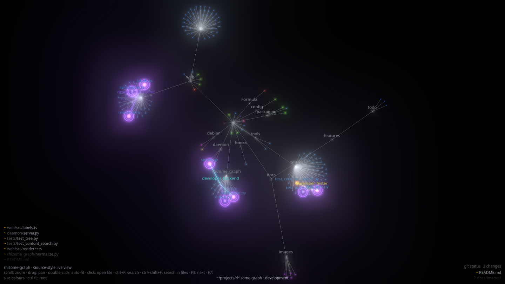
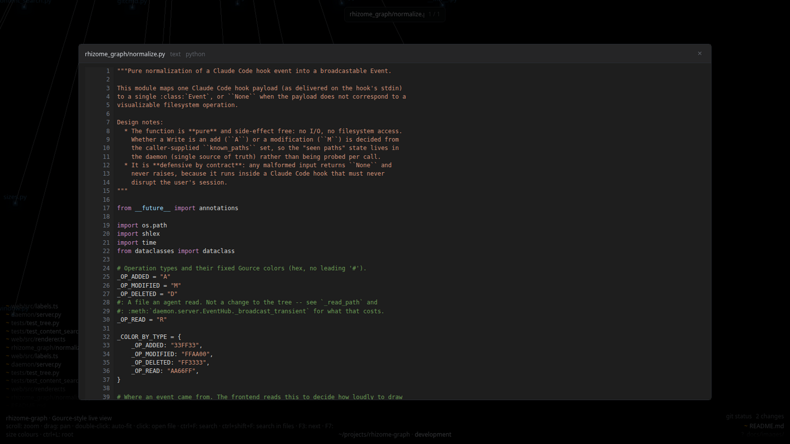
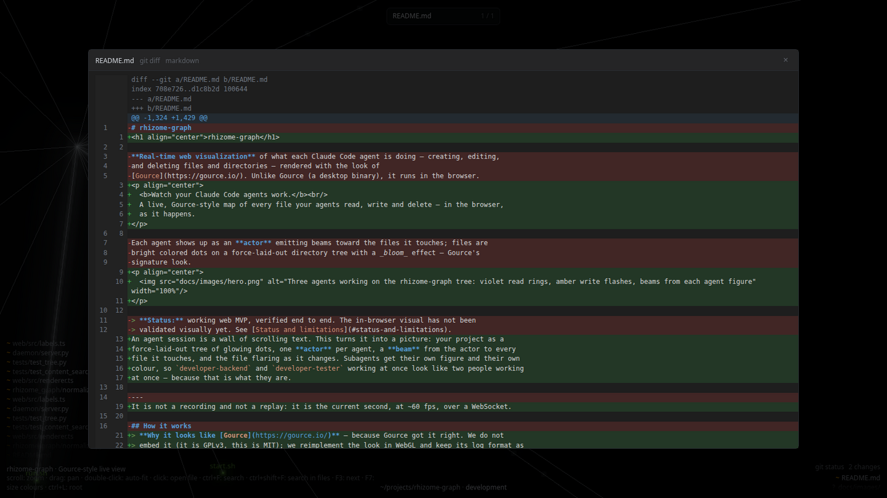
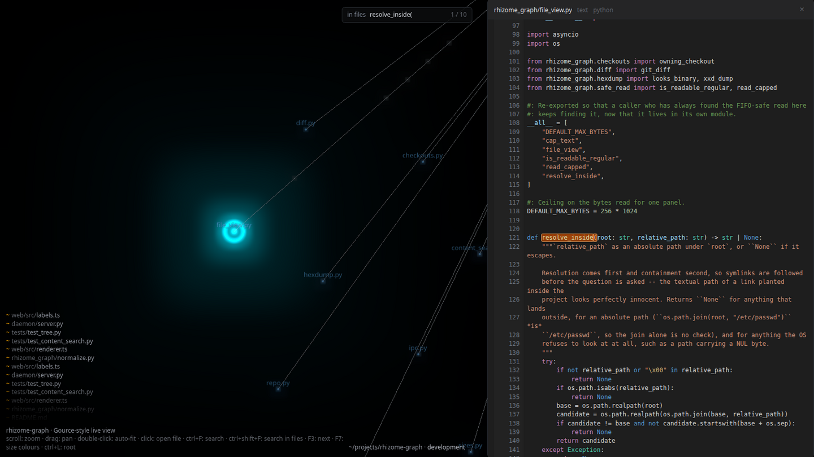
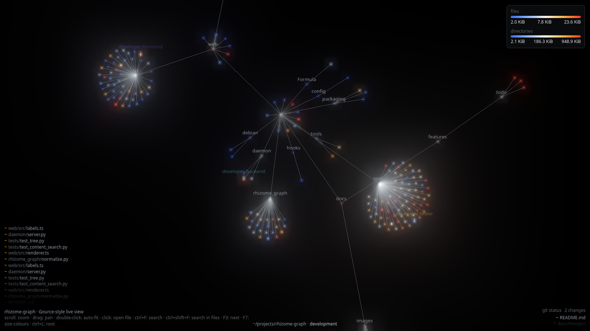
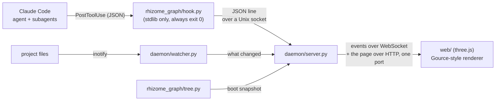

<h1 align="center">rhizome-graph</h1>

<p align="center">
  <b>Watch your Claude Code agents work.</b><br/>
  A live, Gource-style map of every file your agents read, write and delete — in the browser,
  as it happens.
</p>

<p align="center">
  
</p>

An agent session is a wall of scrolling text. This turns it into a picture: your project as a
force-laid-out tree of glowing dots, one **actor** per agent, a **beam** from the actor to every
file it touches, and the file flaring as it changes. Subagents get their own figure and their own
colour, so `developer-backend` and `developer-tester` working at once look like two people working
at once — because that is what they are.

It is not a recording and not a replay: it is the current second, at ~60 fps, over a WebSocket.

> **Why it looks like [Gource](https://gource.io/)** — because Gource got it right. We do not
> embed it (it is GPLv3, this is MIT); we reimplement the look in WebGL and keep its log format as
> our vocabulary.

---

## Try it in two minutes

```bash
git clone https://github.com/BrunoCremaFerreira/rhizome-graph && cd rhizome-graph
RHIZOME_PROJECT_ROOT=/path/to/the/project/you/want/to/watch ./start.sh
```

Then open **<http://localhost:8080>**. The tree is already there — the daemon walks the project at
boot, so the page opens on your project, not on a blank field.

Installed as an application, it is one command:

```bash
rhi /path/to/the/project/you/want/to/watch   # opens a window, serves the same page on :8080
rhi --install-hooks                          # ask it to install the capture hooks
rhi --doctor                                 # are the hooks installed? are they still valid?
```

Point it at the project you want to **watch**, not at `rhizome-graph` itself — or start anywhere
and switch roots live with `ctrl+L`.

**Attribution needs one more step:** without the capture hooks you still see the tree move, but
nobody is on camera. See [Putting agents on camera](#putting-agents-on-camera). The page tells you
so itself when it notices changes arriving with no author.

---

## What you are looking at

| On screen | What it means |
|---|---|
| **Dot** | a file, coloured by extension — or by size, if you press `F7` |
| **Cluster** | a directory, always named |
| **Bright flash, amber** | a file just changed (`M`) |
| **Bright flash, green / red** | a file was created (`A`) / deleted (`D`) |
| **Violet pulsing ring** | an agent is **reading** that file right now (`R`) |
| **Figure with a name** | an agent — the readable `agent_type` of a subagent, or the session |
| **Beam** | that agent, touching that file, in the last second |
| **List, bottom left** | recent changes, folded (`web/src/renderer.ts ×3`) |
| **Caption, bottom centre** | the observed root and its current git branch |
| **Panel, bottom right** | what is uncommitted, across every checkout under the root |

Reads matter more than they sound. An agent reads roughly ten times more than it writes, and until
`R` existed the graph stayed dark through the half of the work that explains the other half: it
read six files, then wrote one, and only the write was on camera. A write is a **flash that
decays**; a read is a **ring that pulses** — a different shape, not a different shade, so the two
never blur together through the bloom.

The camera auto-fits the whole tree until you touch it, then holds your framing so a label stays
still long enough to read. Double-click hands control back.

---

## Click a file. It opens.

<p align="center">
  
</p>

Clicking a dot — or pressing `Enter` on a search hit, or clicking a row in the git status panel —
opens what is inside it. The answer is, in this order:

1. the **`git diff HEAD`** of that path, if it has uncommitted changes,
2. else its **text**,
3. else an **`xxd` hex dump**, byte for byte (the tests compare against the installed `xxd`, not
   against a written spec).

The colours are not an imitation of VS Code: `shiki` carries the real TextMate grammars and the
real Dark+ theme, so `#569CD6` on a keyword is the colour VS Code would paint. The whole
highlighter is lazy — it is not in the entry chunk, and each of the 22 grammars is its own chunk
loaded the first time you open a file in that language. An unknown extension gets a gutter and no
colour, deliberately: no generic lexer guessing.

A dirty file reads like the CLI — old/new line-number gutter, a full-width translucent stripe per
row, syntax colour on top:

<p align="center">
  
</p>

`Escape` or the `×` closes it. The backdrop deliberately does **not** — a stray click outside must
not throw away a long read.

---

## Find things

**`ctrl+F` — by name.** Substring on the file name, or on the whole path once the query contains a
`/`. Matches turn cyan, `F3` walks them one at a time, the camera follows, and `Enter` opens the
one you are resting on.

**`ctrl+shift+F` — by content.** The browser cannot read your disk, so the daemon greps it: no
fork, no `re`, no `git grep` (which would miss untracked files and has nothing to say about a
directory that is not a repository). Matching files light up on the graph, and `F3` walks
**occurrence by occurrence, across files** — each step that crosses into another file flies the
camera to its dot and opens that file in a panel **docked to the right**, matches tinted, the
active one stronger, scrolled to its row.

<p align="center">
  
</p>

The graph stays live and clickable underneath while you read — which is exactly why the content
walk is allowed to open files and the name walk is not.

**`F7` — colour by size.** The tree repaints on a size ramp, with a legend in the top-right corner
saying what the colours are worth. Files and directories get their own scale, because a directory
is the sum of its files and on the files' scale the answer would only ever be "directories are
big".

<p align="center">
  
</p>

**`ctrl+L` — change the project.** A bar with shell-style tab completion (the daemon answers it,
since the browser cannot list your disk). The switch is global: one daemon watches one root, so
every open viewer follows.

---

## How it works

Nothing here reimplements capture, and nothing here parses a diff by hand. Claude Code already
emits a hook on every tool call; the filesystem already reports every write.



**Two capture sources, on purpose.** Hooks know *who* — they carry the agent's id — but they only
see Claude's own file tools and cannot resolve a glob or a compound shell command. The watcher
knows *what* — every change, whoever made it — but nothing about authorship. The daemon combines
them: a filesystem change landing within a few seconds of a hook inherits that hook's agent, so
`cp src/*.md docs/` draws a beam at each file actually copied, and a path a hook just reported is
suppressed on the watcher side so one write flashes exactly once.

1. **Seed** — the daemon walks the root once at boot (skipping `.git`, `node_modules`, build
   output) and publishes the tree. Every client gets that snapshot on connect, however long the
   daemon has been up.
2. **Capture** — the `PostToolUse` hook **forwards the raw payload and nothing else**: pure
   stdlib, no third-party import, and it **always exits 0**. A hook that fails loudly degrades the
   agent session it was supposed to be watching.
3. **Normalize + aggregate** — the daemon owns the shared state: the set of seen paths (which is
   what decides `A` vs `M`, and what lets a directory delete prune its subtree), the seed, the
   replay buffer, and who acted last.
4. **Transport** — a Unix socket in, WebSocket + static HTTP out, **on a single port**. One
   forwarded port is enough for SSH or VS Code remote, and the browser derives the socket URL from
   its own origin.
5. **Render** — three.js, d3-force and `UnrealBloomPass`. Every decision worth testing lives in a
   pure module the renderer only draws the result of.

### The event on the wire

```json
{ "ts": 1754870400.12, "agent": "a4f1…", "label": "developer-backend",
  "type": "M", "path": "web/src/renderer.ts", "color": "FFAA00", "origin": "hook" }
```

`type` is `A`dded, `M`odified, `D`eleted or `R`ead (`R` is ours, not Gource's: the file was
*opened*, nothing about the tree changed). `origin` says how loudly to draw it:

| `origin` | Meaning | On screen |
|---|---|---|
| `hook` | a Claude Code tool call | flash or ring, agent figure, beam |
| `watch` | a change seen on disk | flash; figure and beam only if attributed |
| `seed` | part of the boot snapshot | dim node, no figure, no flash |

`agent` is **identity**, `label` is only text. An event with `agent: ""` — a seeded file, a manual
edit, a build step — is real and is drawn, but never invents an actor.

---

## Putting agents on camera

The graph moves without hooks. It gets **names and figures** only with them.

```bash
rhi --install-hooks     # writes into the observed project's .claude/settings.json, after asking
rhi --doctor            # reads BOTH ~/.claude and the project's file, the way Claude Code does
```

`rhi` never writes silently: `.claude/settings.json` is a committed file in many repositories, and
merging hook arrays behind your back is how someone loses a hook. To do it by hand, copy the
`"hooks"` block from [`config/settings.json`](config/settings.json):

```json
{
  "hooks": {
    "PostToolUse": [
      {
        "matcher": "Write|Edit|MultiEdit|Bash|Read",
        "hooks": [{ "type": "command", "command": "/usr/bin/rhi-hook" }]
      }
    ]
  }
}
```

`Read` is in the matcher on purpose: it is not a change to the tree at all, but it is what lights a
file violet while an agent is looking at it. From a checkout with nothing installed the command is
`python3 /path/to/rhizome-graph/hooks/emit_event.py` instead — one implementation, reached by the
older name. Prefer the installed `rhi-hook` where you have it: a hook naming a path inside somebody's
checkout stops working the day that checkout moves, and it then fails *louder* than a missing hook —
a blocking error on every tool call, degrading the agent session rather than the graph. That is the
rot `--doctor` exists to find.

**Hook changes only apply to sessions started afterwards** — Claude Code reads `settings.json` at
startup.

### When nothing shows up

The hook swallows every error by design, so "the daemon is down" looks exactly like "nothing is
happening". To tell them apart, set `RHIZOME_DEBUG_LOG` on the hook command to record its
*failures*, or `RHIZOME_TRACE_LOG` to record every raw payload — which is how the shape of the
hook JSON gets re-settled on a new Claude Code version.

**A tree that updates while nobody is on camera means the hooks are not installed.** The page says
so itself, in the HUD, once activity has arrived with no author.

---

## Reference

### Keys

| Key | Effect |
|---|---|
| scroll / drag | zoom under the cursor / pan |
| double-click | hand control back to auto-fit |
| hover | name the dot under the pointer |
| click | open the file |
| `ctrl+F` | search by name — `F3` walks, `Enter` opens |
| `ctrl+shift+F` | search inside files — `F3` walks occurrences and opens them docked |
| `F3` | next match |
| `F7` | colour the tree by file size |
| `ctrl+L` | change the observed root (with tab completion) |
| `Esc` | close the panel, then the search bar |

### `rhi`

| Command | Effect |
|---|---|
| `rhi DIR` | watch `DIR`, open a window, serve the page on `:8080` |
| `rhi --no-window` | headless host: serve the page and open nothing |
| `rhi --port N` / `--socket PATH` | an explicit request is **obeyed or refused**, never adjusted |
| `rhi --doctor` | report the hooks and start nothing |
| `rhi --install-hooks` | write the hooks into the project's `.claude/settings.json` |

The default port *is* adjusted — `:8080` busy means it walks on and prints what it got — because a
default may move and an explicit request may not: a user who typed `9000` and silently got `9001`
has been lied to.

### `start.sh` (from a checkout)

| Command | Effect |
|---|---|
| `./start.sh` | full idempotent bootstrap: venv, deps, `web/dist`, daemon on `:8080` |
| `./start.sh --dev` | daemon + Vite with hot reload on `:5173` |
| `./start.sh --rebuild` | force a reinstall and rebuild of the front end |
| `./start.sh --no-build` | serve the existing `web/dist`, skip Node entirely |
| `./start.sh --print-token` | print the control token and start nothing |

`run.sh` is the minimal launcher (daemon only, everything assumed prepared).

### Environment

| Variable | Default | Description |
|---|---|---|
| `RHIZOME_PROJECT_ROOT` | cwd | the project to seed, watch and relativize paths against |
| `RHIZOME_HTTP_PORT` | `8080` | one port for the page **and** the WebSocket at `/ws` |
| `RHIZOME_SOCKET` | `/tmp/rhizome-graph.sock` | ingest socket; hook and daemon must agree |
| `RHIZOME_WEB_DIST` | searched | where the built front end lives — obeyed or refused, never overruled |
| `RHIZOME_STATUS_INTERVAL` | `3` | seconds between `git status` polls; `≤ 0` disables them |
| `RHIZOME_TOKEN` | minted at boot | the control token (see below) |
| `RHIZOME_DEBUG_LOG` | unset | set it on the **hook** to record its failures |
| `RHIZOME_TRACE_LOG` | unset | set it on the **hook** to record every raw payload |

### The control token

Watching costs nothing. **Commanding** — `ctrl+L`, its tab completion, opening a file, searching in
files — needs a token, because that half of the socket can read files off the host.

The daemon mints one at boot and **injects it into the `index.html` it serves**, so the page you
loaded already carries it and there is nothing to type. That survives `ssh -L` and VS Code
forwarding on any port, since the page and its token travel together.

It exists because the peer's address lies, in two measured ways. A WebSocket handshake is exempt
from the same-origin policy and needs no preflight, so any page in any browser on the host can open
`ws://127.0.0.1:8080/ws` and start sending commands — it just cannot read this token, because
same-origin is precisely what stops it fetching the page the token lives in. And any loopback-side
proxy launders a remote connection into a local one; `--dev` runs one.

**If the graph draws but every command is refused, this is why** — not a broken page.
`./start.sh --print-token` shows what the daemon expects.

---

## Requirements

- **Python 3.10+** for the daemon (`websockets`, `watchdog` — `pip install -e '.[daemon]'`, or just
  run `./start.sh`). The hook itself needs **nothing**.
- **Node.js 18+** only to *build* the front end. If `web/dist` exists you can run without Node.
- **`git`** is optional — without it the diff and the uncommitted-changes panel simply go quiet.

> If you edit anything under `web/src/`, you need Node: `start.sh` **silently serves a stale
> build** when Node is missing, so a front-end change then looks like it did nothing. Rebuild with
> `./start.sh --rebuild`.

### Installing

| From | How |
|---|---|
| a checkout | `pip install -e '.[daemon]'` and run `rhi`, or just `./start.sh` |
| a `.deb` | `packaging/build-deb.sh` builds one that writes nothing into the checkout; it installs `rhi` and `rhi-hook` |
| Homebrew | [`Formula/rhizome-graph.rb`](Formula/rhizome-graph.rb) |

The `.deb` vendors **`websockets` and nothing else** (1.4 MB) so that `python3-watchdog` and
`python3-gi` keep coming from the distribution and its security updates, and `git` is a
*Recommends*, not a *Depends*. The two commands split along the same line the hook doctrine does:
`rhi-hook` is `#!/usr/bin/python3` and never pays a virtualenv's import cost on the agent's hot
path, while `rhi` names the vendored interpreter, because the daemon imports
`websockets.asyncio.server`. Neither has been installed on a real machine yet — see
[Status](#status).

---

## Development

Built test-first, by [specialist agents](.claude/agents) — a tester that writes only failing tests,
a backend and a frontend developer that take them green, an architect and a security auditor that
write no code at all. The rules are in [`CLAUDE.md`](CLAUDE.md).

```bash
python3 -m venv .venv && .venv/bin/pip install -e '.[dev]'
.venv/bin/python -m pytest          # backend

cd web && npm install
npm test && npm run build           # frontend
```

`renderer.ts` needs a WebGL context and cannot be unit-tested, so every decision worth testing
lives in a pure sibling that imports neither three.js nor the DOM — `simulation.ts`, `view.ts`,
`labels.ts`, `search.ts`, `fileDoc.ts`, `sizeMode.ts` — and the renderer only draws what they
return. New front-end logic belongs in one of those, not in the renderer.

```
rhizome_graph/   normalize · tree · paths · token · hexdump · safe_read · gitcmd
                 diff · status · checkouts · file_view · content_search · cli · hook
daemon/          server.py (seed, attribution, dedupe, WebSocket + HTTP) · watcher.py
web/src/         renderer.ts (three.js) + the pure modules it draws
tests/  web/tests/   pytest · vitest
```

---

## Status

Working end to end, and honest about its edges.

- ✅ **Backend** — 1364 `pytest` green (plus 20 opt-in packaging tests). Seeds the tree, ingests
  hook events, watches the filesystem, serves the page and the WebSocket on one port, polls
  `git status` across every checkout under the root, and answers file, search and root-completion
  commands behind two gates.
- ✅ **Frontend** — 1403 `vitest` green, `tsc` and `vite build` clean.
- ✅ **Integration, against a live daemon** — the tree seeds on connect; a `Write` flashes exactly
  once across both channels; `cp *.md docs/` credits the agent for each file actually copied;
  `rm -rf docs/` prunes the subtree; a read outside the root produces no event at all; real
  captured hook payloads replay into two distinct actors, the subagent's carrying its `agent_type`.
- ⚠️ **The window and the packaging are unproven on a real desktop.** `rhi` opens a pywebview or
  app-mode-browser window; that path has never run on a machine with a display. The `.deb` builds
  and has been inspected but never installed; the Homebrew formula has never been executed at all.
- ⚠️ **Visual tuning is unfinished.** The renderer is verified by unit tests and by the screenshots
  above; how the read ring reads against a fresh write flash, and how sixteen repositories' worth
  of status rows read at a narrow window, are judgements nobody has made on a real monitor yet.

> The screenshots on this page are real frames from a live daemon watching this repository, driven
> by real hook payloads — but captured in headless Chromium on a **software** GL backend, at a few
> frames per second. On a GPU the bloom is brighter and the motion is fluid; nothing else differs.

**Not yet built:** per-repository grouping in the status panel, custom avatar *images* per agent,
`.gitignore` parsing (a fixed skip list stands in), session recording and replay.

**Known limits, by design:** attribution of *watcher* events is time-based, so two agents writing
in the same instant can be credited to one of them (hook events themselves are attributed exactly);
the parser stays silent rather than guessing a path from a glob or a directory destination, and
lets the watcher fill it in milliseconds later; file content crosses the wire capped at 256 KiB;
and label textures are rasterised at the pixel ratio the renderer started with, so dragging the
window to a monitor of a different DPI leaves names slightly soft until a reload.

---

## License

[MIT](LICENSE). The visual is a **reimplementation** of Gource's look in WebGL; Gource's source
(GPLv3) is not used or redistributed here, which is what lets this be MIT.

Gource: <https://gource.io/>
